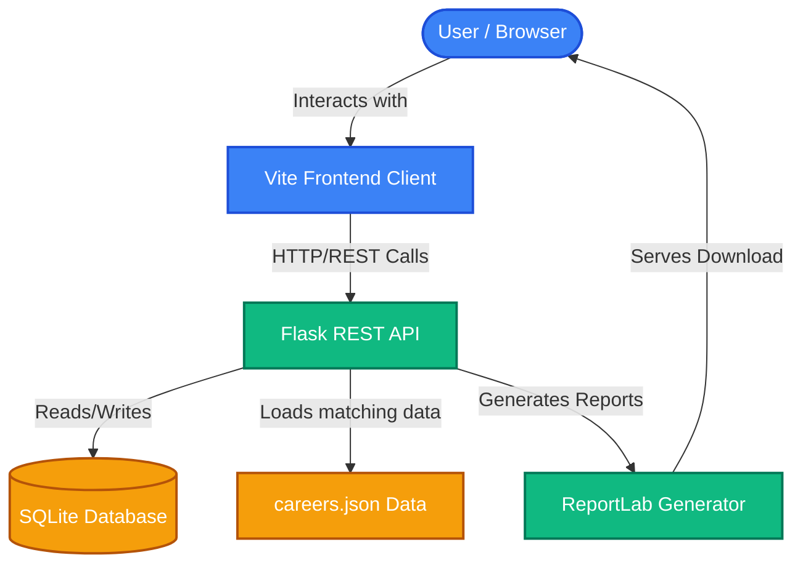
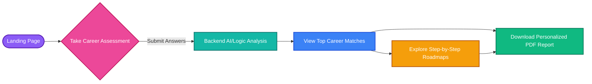

<div align="center">
  <h1>🧬 Career DNA</h1>
  <p>
    <strong>A personalized career discovery platform that analyzes your profile and provides actionable, step-by-step career roadmaps.</strong>
  </p>
</div>

<hr />

## 📖 Overview

**Career DNA** is an intelligent web application designed to help individuals navigate their professional growth. By analyzing user interests, skills, and personality traits, the platform recommends tailored career paths. Each recommendation includes deep insights into market demand, salary expectations, and a structured learning roadmap.

---

## 🏛️ System Architecture

The application follows a decoupled client-server architecture, ensuring a fast, responsive user interface backed by a robust Python API.



---

## 🔄 User Journey Flow



---

## ✨ Key Features

- **🎯 Personalized Discovery:** Receive tailored career recommendations based on your unique assessment profile.
- **📈 Comprehensive Insights:** Access in-depth data on roles, including required skills, demand metrics, salary bands, and future growth.
- **🗺️ Actionable Roadmaps:** Follow step-by-step guides from beginner to professional, complete with certification recommendations.
- **📄 Exportable Reports:** Generate and download personalized, detailed PDF career reports for offline reading.
- **⚡ Fast & Responsive:** Enjoy a seamless, interactive user interface built on a modern Vite static frontend.

---

## 🛠️ Technology Stack

**Frontend Architecture**
- **Core:** HTML5, CSS3, Vanilla JavaScript
- **Tooling:** Vite (Lightning-fast development server and bundler)

**Backend Architecture**
- **Framework:** Python 3 & Flask
- **Database:** SQLite3
- **PDF Generation:** ReportLab
- **API Security:** Flask-CORS for secure cross-origin requests

---

## 🚀 Getting Started

Follow these instructions to set up the project locally for development and testing.

### Prerequisites

Ensure you have the following installed:
- [Node.js](https://nodejs.org/) (v18.0.0 or higher)
- [Python](https://www.python.org/) (v3.8 or higher)
- [Git](https://git-scm.com/)

### 1. Clone the Repository

```bash
git clone https://github.com/Yuvashri2516/CareerDNA.git
cd CareerDNA
```

### 2. Backend Setup & Execution

The backend API serves data and handles PDF generation. 

```bash
# Navigate to the backend directory
cd backend

# Create a virtual environment
python -m venv .venv

# Activate the virtual environment
# On Windows:
.venv\Scripts\activate
# On macOS/Linux:
source .venv/bin/activate

# Install required Python packages
pip install -r requirements.txt

# Start the Flask development server
python app.py
```
*The API will start locally at `http://127.0.0.1:5000`.*

### 3. Frontend Setup & Execution

Open a **new terminal window/tab**, navigate to the project root, and then into the frontend directory.

```bash
# Navigate to the frontend directory
cd frontend

# Install Node modules
npm install

# Start the Vite development server
npm run dev
```
*The frontend will be available at `http://localhost:5173`. Open this URL in your browser to view the application.*

---

## 📁 Repository Structure

```text
CareerDNA/
├── backend/                  # Flask backend environment
│   ├── app.py                # Main API application & routing
│   ├── database/             # SQLite DB directory
│   └── requirements.txt      # Python dependencies
├── frontend/                 # Vite static frontend environment
│   ├── src/                  # Client-side JavaScript
│   ├── static/               # Assets, images, and CSS
│   ├── templates/            # HTML templates and views
│   └── package.json          # Node dependencies & scripts
└── data/                     # JSON data stores (e.g., careers.json)
```

---

## 🤝 Contributing

We welcome contributions to make Career DNA even better! 
If you have suggestions, bug reports, or feature requests, please check the [Issues page](https://github.com/Yuvashri2516/CareerDNA/issues) and feel free to open a Pull Request.

---

<div align="center">
  <p>Built with ❤️ for career explorers.</p>
</div>
